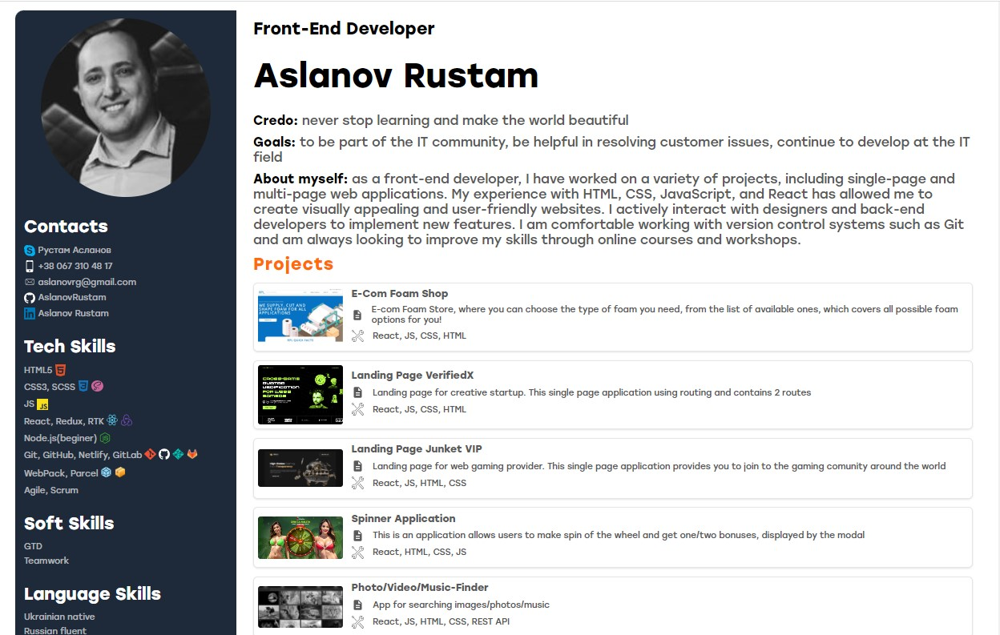

# CV Aslanov Rustam

## Front-End Developer

Hello, couple words about myself - as a front-end developer, I have worked on a variety of projects, including single-page and multi-page web applications. My experience with HTML, CSS, JavaScript, and React has allowed me to create visually appealing and user-friendly websites. I actively interact with designers and back-end developers to implement new features. I am comfortable working with version control systems such as Git and am always looking to improve my skills through online courses and workshops.

## Technology stack

React, Redux, RTK, JS, HTML, CSS,Node.js(beginer),Git, GitHub, Netlify, GitLab
